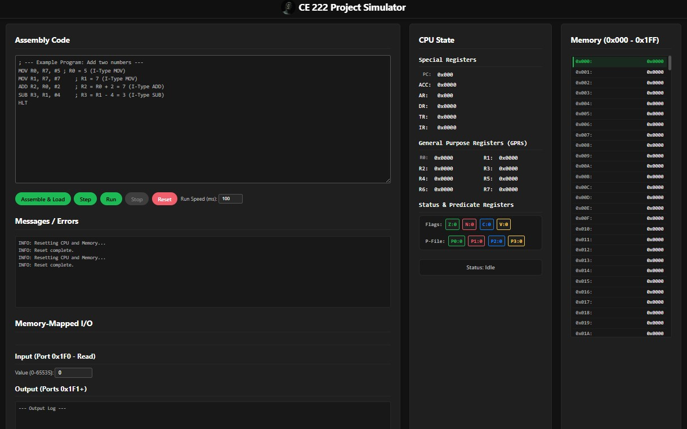

# 🎮 PrediCore Engine - Web Simulator 🧠

[](https://opensource.org/licenses/MIT) <!-- Optional: MIT License Badge -->
<!-- Add other badges if applicable (e.g., build status, version) -->

 <!-- Make sure filename matches your screenshot -->

Welcome to the **CE222 Project** web-based simulator! This project provides an interactive environment for learning and experimenting with a custom 16-bit educational Instruction Set Architecture (ISA). Dive into the fundamentals of computer architecture, assembly programming, and the unique concept of **predicated execution** right in your browser.

---

## ✨ Features

*   **🌐 Web-Based:** Runs anywhere. No setup required.
*   **💻 Code Editor:** Write or paste our Custom assembly.
*   **⚙️ Assembler:** Built-in two-pass assembler with label resolution and error reporting.
*   **📊 CPU State View:** Real-time display of GPRs (R0-R7), Special Registers (PC, ACC, etc.), Status Flags (Z, N, C, V), and Predicate Registers (P0-P3).
*   **💾 Memory Inspector:** Visualize the 512x16-bit memory, with PC and MMIO highlighting.
*   **⏯️ Execution Control:** Step-by-step execution, continuous run with adjustable speed, stop, and reset capabilities.
*   **💡 Predication:** Observe conditional instruction skipping/execution based on the P-File state.
*   **🔌 Memory-Mapped I/O:** Simulate input (pauses for user) and output through designated memory addresses.
*   **📜 Logging:** Clear messages from the assembler and simulator runtime.
*   **🎨 Dark Theme:** Easy on the eyes.

---

## 🚀 Quick Start

1.  **Clone or Download:** Get the code from this repository.
    ```bash
    git clone https://github.com/mIBRAHIM707/Processor-Simulator
    ```
    (Or download the ZIP)
2.  **Open:** Launch the `index.html` file in your favorite modern web browser.

---

## 📖 Usage Guide

1.  **Write:** Enter assembly code in the editor pane. Use `;` for comments.
2.  **Assemble:** Click `Assemble & Load`. Check the message area below for success or errors.
3.  **Run/Step:** Use the `Step` button for single-cycle execution or `Run` for continuous execution. Adjust `Run Speed` as needed. `Stop` halts a continuous run.
4.  **Observe:** Monitor the CPU State and Memory View panels to understand execution flow and data changes.
5.  **I/O:**
    *   **Input:** If your code executes `LDR 0x1F0`, the simulator pauses. Enter a value (0-65535) in the I/O panel and click `Provide Input`.
    *   **Output:** Values written using `STR` to addresses `0x1F1` through `0x1FF` appear in the I/O Output log.
6.  **Reset:** Click `Reset` to clear everything and start fresh.

---

## 📐 PrediCore ISA Overview

The PrediCore ISA is a simplified 16-bit architecture designed for education.

*   **Word Size:** 16 bits
*   **Address Space:** 9 bits (512 words, `0x000` - `0x1FF`)
*   **Instruction Size:** Fixed 16 bits
*   **Key Feature:** Predicated execution via 4 predicate registers (P0-P3) set by `SETP` based on `ZNCV` flags (only modified by `CMP`).
*   **Registers:**
    *   8 x 16-bit General Purpose Registers (R0-R7)
    *   1 x 16-bit Accumulator (ACC - implicit for LDR/STR)
    *   9-bit Program Counter (PC) & Address Register (AR)
    *   16-bit Data Register (DR), Instruction Register (IR), Temp Register (TR)
    *   4 x 1-bit Status Flags (Z, N, C, V)
    *   4 x 1-bit Predicate Flags (P0-P3)
*   **Addressing Modes:** Immediate (`#Imm3`), Register Direct, Direct Absolute (`Address`), Implicit (`ACC`, Flags).
*   **Formats:** Memory Ref, R-Type, I-Type, Branch, SETP, HLT.
*   **I/O:** Memory-Mapped (`0x1F0` for input, `0x1F1-0x1FF` for output).

*(For a complete specification, please refer to the detailed documentation.*

---

## 🛠️ Example Snippet

```assembly
; Example: Conditional Increment using Predication
; If R1 == 5, increment R0

    MOV R1, R7, #5     ; R1 = 5
    MOV R0, R7, #10    ; R0 = 10 (initial value)
    MOV R2, R7, #5     ; R2 = 5 (value to compare against)
    MOV R3, R7, #1     ; R3 = 1 (increment value)

    CMP R1, R2         ; Compare R1 (5) with R2 (5). Sets Z=1.
    SETP EQ, P0        ; Set P0 if Equal (Z=1). P0 becomes 1.

    (P0) ADD R0, R0, R3 ; Execute if P0=1: R0 = R0 + R3 = 10 + 1 = 11

    HLT                ; Check R0 value
